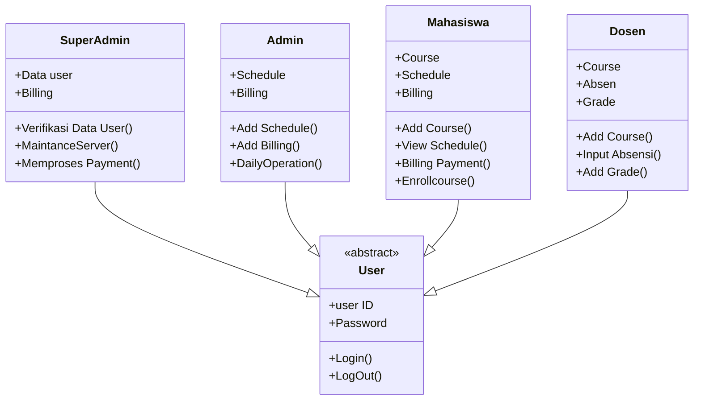

# FURPS SISFO
## Functional Requirements (F)
### Autentikasi dan Otorisasi: 
F1: Pengguna harus dapat mendaftar dan masuk ke portal kampus dengan aman.  
F2: Peran pengguna yang berbeda seperti mahasiswa, dosen, dan administrator harus memiliki tingkat akses dan izin yang berbeda.

### Manajemen Mata Kuliah:
F4: Mahasiswa harus dapat melihat mata kuliah yang tersedia, mendaftar mata kuliah, dan menghapus mata kuliah jika diperlukan.

### Informasi Akademik:
F5: Mahasiswa harus dapat melihat informasi akademik mereka seperti nilai, IPK, dan jadwal kuliah.  

### Komunikasi:
F8: Dosen harus dapat membuat pengumuman, tugas, dan materi kuliah untuk mahasiswa.

## Usability Requirements (U)
### Antarmuka Pengguna:
U1: Antarmuka portal harus intuitif, mudah dinavigasi, dan responsif di berbagai perangkat. 
U2: Instruksi yang jelas dan ringkas harus disediakan untuk setiap fitur untuk membantu pengguna memahaminya.

### Aksesibilitas:
U3: Portal harus mematuhi standar aksesibilitas untuk memastikan pengguna dengan disabilitas dapat mengakses dan menggunakan platform secara efektif.

## Reliability Requirements (R)
### Ketersediaan Sistem:
R1: Portal harus memiliki waktu aktif tinggi, memastikan tersedianya kepada pengguna sepanjang waktu kecuali selama periode pemeliharaan yang dijadwalkan.
### Integritas Data:
R2: Portal harus memiliki mekanisme untuk mencegah kehilangan data atau korupsi, memastikan integritas catatan akademik dan informasi pengguna.

## Performance Requirements (P)
### Waktu Respon:
P1: Portal harus merespons tindakan pengguna dengan cepat, dengan latensi minimal, untuk memberikan pengalaman pengguna yang mulus.
### Skalabilitas:
P2: Portal harus dapat menangani jumlah pengguna yang besar secara bersamaan, terutama selama periode pendaftaran yang padat.

## Support Requirements (S)
### Dokumentasi:
S1: Dokumentasi komprehensif harus disediakan untuk pengguna, administrator, dan pengembang untuk membantu dengan pengaturan, penggunaan, dan pemeliharaan portal.
### Dukungan Teknis:
S2: Pengguna harus memiliki akses ke saluran dukungan teknis seperti email atau helpdesk untuk melaporkan masalah dan menerima bantuan dengan cepat. 
### Keamanan:
S3: Portal harus menerapkan langkah-langkah keamanan yang kuat untuk melindungi data pengguna, mencegah akses yang tidak sah, dan melindungi dari ancaman siber.

# USER STORY
### User Roles (Actor)
- Mahasiswa
- Admin
- Dosen
- Super Admin

#### Mahasiswa
- Mendaftar Course
- Melihat Jadwal
- Membayar Tagihan

#### Dosen
- Upload Course
- Input Absensi
- Add Grade

#### Super Admin
- Management Data user
- Maintance  Sistem
- MEMPROSES TAGIHAN/PEMBAYARAN

#### Admin
- Upload Jadwal
- Daily Operation
- Upload Tagihan

# USE CASE SISFO

# CLASS DIAGRAM

